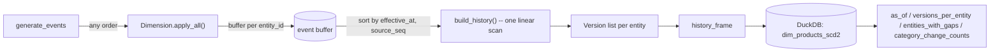

# scd2-ingestion

> Incremental, idempotent SCD Type 2 dimension ingestion that correctly handles late-arriving and out-of-order change events, with a randomized order-independence proof.

[](https://github.com/Prithv122/scd2-ingestion/actions/workflows/ci.yml)

**Live demo:** not deployed — CLI + DuckDB project, runs locally by design.
**Stack:** Python 3.13 · DuckDB · pandas · argparse CLI. No services, no API keys.

---

## 1. The problem

Every dbt tutorial reaches for the built-in `snapshot` macro to get SCD Type 2 history
"for free." That macro assumes each check run sees the dimension's data strictly moving
forward in time — which is exactly the assumption that breaks the moment a batch arrives
late, a CDC stream redelivers an old record, or two ingestion workers race each other.
This project exists to answer the question a tutorial snapshot never has to: **if a
change event's business-effective date is earlier than data you've already recorded, or
if the same event gets replayed, or if two pipeline runs process a batch in a different
order, does the resulting history still come out identical?** The answer here is proven,
not asserted — a randomized property test applies the same 4,000+ event stream in
hundreds of random arrival orders and checks the final table byte-for-byte. The first
implementation failed that test 50 times out of 50 on its first run; see NOTES.md and
section 4 for what that bug was and the redesign it forced.

## 2. The data

| | |
|---|---|
| Source | A synthetic but structurally realistic product-catalog change stream, generated by `events.py` |
| Size | 4,115 change events → 3,519 history rows across 50 products, 2023-01-01 to 2024-12-31 |
| Licence | N/A — generated, not sourced |
| Refresh | Deterministic given a seed; regenerate any time with `scd2-ingestion simulate` |

This is synthetic data, and every number in section 5 says so again next to the number.
The generator (`events.generate_events`) isn't a random-noise stress test dressed up as
a dataset: each product gets a create date, a per-day chance of a price/category change,
and a smaller chance of discontinuation followed by relaunch — a lifecycle
(create → update* → delete → recreate → update* → ...) that is exactly what a real
product catalog does, just compressed into two years instead of five.

## 3. Architecture



## 4. Key decisions & tradeoffs

| Decision | Chose | Over | Why |
|---|---|---|---|
| Merge strategy | Buffer every event per entity; **rebuild that entity's full history from a canonical `(effective_at, source_seq)` sort** on every new event | An incremental algorithm that patches an existing version list in place based on where the new event's timestamp falls among current intervals | The incremental version was built first, passed every hand-written unit test, and then failed a randomized shuffle-order test 50/50 times: a delete applied before the upserts that should have carved out the interval it was shrinking would permanently commit to the wrong boundary. A full rebuild from a sort has no such case to get wrong — see NOTES.md for the actual bug and the trace that found it. |
| Correctness evidence | A randomized property test: apply the same 4,000+ event set in 500 random arrival orders, assert the final table is identical every time | Hand-picked unit tests for "typical" late-arrival scenarios | Hand-picked cases are exactly what the first (broken) implementation passed. Only a property test that can't be gamed by picking convenient examples actually exercises the interaction between multiple simultaneous delete/recreate cycles that broke the incremental version. |
| Idempotency tie-break | A source-assigned logical clock (`source_seq`), not arrival order | "First event wins" / "last event applied wins" | Two events can legitimately share the same `effective_at` (a source correcting its own mistake). Arrival order isn't a valid tie-break if the whole point is that arrival order shouldn't matter; a logical clock assigned at generation time is. |
| Storage | DuckDB, a single embedded file | Postgres | This project's subject is the merge algorithm and its correctness proof, not a service. DuckDB gives real SQL (window functions, point-in-time joins) with zero infrastructure, which is the right amount of infrastructure for what's being demonstrated here. |

## 5. Results

All numbers below are from `uv run scd2-ingestion simulate --entities 50 --start 2023-01-01
--end 2024-12-31 --seed 0 --arrival-seed 1` and `uv run scd2-ingestion
verify-order-independence --entities 50 --start 2023-01-01 --end 2024-12-31 --trials 500`
against the synthetic generator described in §2 — reproduce with the commands in §6.

| Metric | Value | Notes |
|---|---|---|
| **Order-independence trials** | **500 / 500 identical** | Same 4,115-event stream, 500 independent random arrival orders, byte-identical final history every time |
| Events generated → history rows | 4,115 → 3,519 | Across 50 synthetic products, 2 years |
| Versions per entity | min 39, max 99, mean 70.4 | `versions_per_entity()` — confirms the merge isn't silently duplicating rows on replay |
| Entities with a delete→recreate gap | **50 / 50** | Every synthetic product was discontinued and relaunched at least once — the create/delete/recreate lifecycle isn't a rare edge case in this dataset, it's the norm |
| Total delete→recreate cycles | 579 | `entities_with_gaps()`, summed across all 50 entities |
| Entities with ≥1 category reclassification | 50 / 50 | `category_change_counts()`; most-reclassified entity changed category 25 times over 2 years |
| Point-in-time example | `sku-0000` as of 2024-06-15 → *electronics*, price 997.10 (synthetic, unitless), valid 2024-06-12 → 2024-07-01 | `scd2-ingestion asof sku-0000 2024-06-15`, reconstructed entirely from history, not a "current" table |

**The bug that made this project what it is:** the first merge implementation shrank an
existing version's `valid_to` in place whenever a delete landed inside it — correct in
isolation, wrong when a *later-processed* upsert had not yet split that interval at the
point the delete actually needed to land. Concretely: applying `create → delete@05-18 →
upsert@06-17` before `delete@03-03 → upsert@04-03 → delete@04-21 → upsert@04-29` (all for
the same entity, all real events from the generator) caused the 2024-04-21 deletion to
silently disappear — the 03-02→04-03 boundary was correct, but 04-03→04-29 got
absorbed into a single un-deleted version instead of showing the second delete/recreate
cycle. Full trace in NOTES.md.

## 6. How to run

```bash
git clone https://github.com/Prithv122/scd2-ingestion.git
cd scd2-ingestion
uv sync
uv run pytest   # 45 tests, 99% coverage, includes the order-independence property test
```

```bash
uv run scd2-ingestion simulate --entities 50 --start 2023-01-01 --end 2024-12-31 \
    --db-path data/catalog.duckdb
uv run scd2-ingestion verify-order-independence --entities 50 --start 2023-01-01 \
    --end 2024-12-31 --trials 500
uv run scd2-ingestion asof sku-0000 2024-06-15 --db-path data/catalog.duckdb
```

No `.env`, no external services — `data/catalog.duckdb` is a local file, rebuilt fresh
by `simulate` on every run.

## 7. What I'd change at 100× scale

At 50 entities and ~4,000 events, rebuilding one entity's *entire* history from its full
buffered event list on every new event is instant. At 100× the entity count that's still
fine (each entity's rebuild is independent and still small). At 100× the *events per
entity* — a dimension that changes daily for years rather than a "slowly changing"
handful of times — the O(events-per-entity) rebuild-on-every-write stops being free, and
the design would need to change: keep the sorted event buffer as an append-only log,
periodically checkpoint the derived version list, and only replay events newer than the
last checkpoint on each rebuild, rather than the full history every time. Second, the
in-memory event buffer (a Python list per entity) doesn't survive a process restart —
a production version would need to persist the raw event log itself (not just the
derived `Version` table) so a restart can rebuild state rather than losing the buffer.
Third, DuckDB's single-file, single-writer model is exactly right for "one batch job
computes the whole table" and exactly wrong for concurrent writers — that would need to
move to a real warehouse (Postgres, or a lakehouse table format) with the same merge
logic, unchanged, just targeting a different sink.

---

## References

No external SCD2 implementation was used as a reference — the design (buffer, sort,
linear-scan rebuild) was arrived at directly in response to the order-independence bug
described in section 4 and NOTES.md, not adapted from a known pattern. The general
concept of Slowly Changing Dimension Type 2 is standard data-warehousing terminology
(Kimball); the specific merge algorithm and its correctness proof are this project's own.
